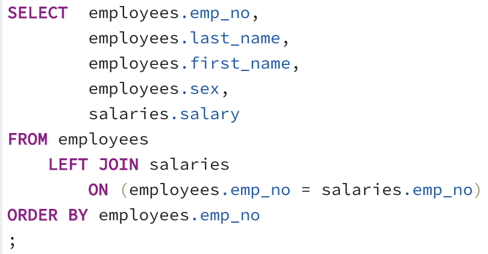
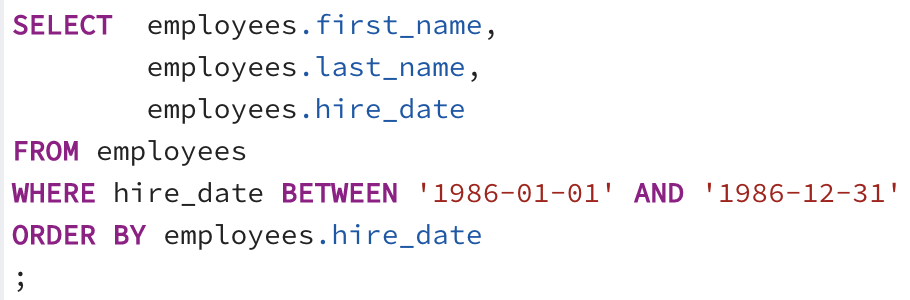
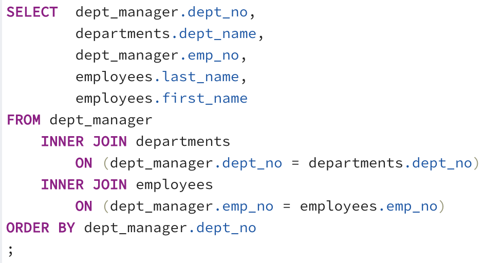
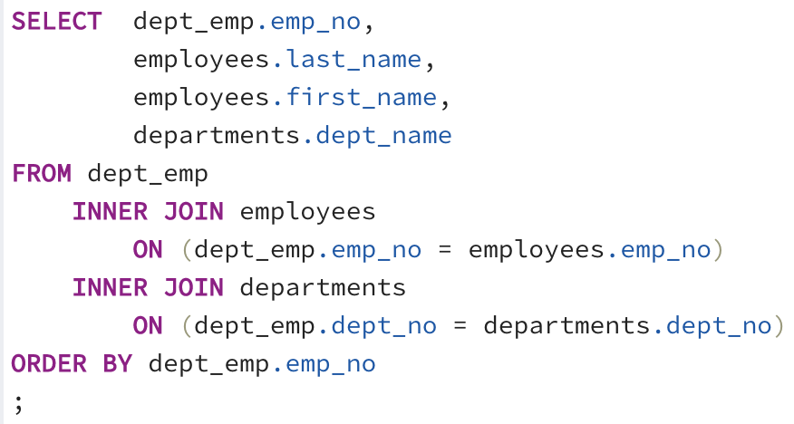
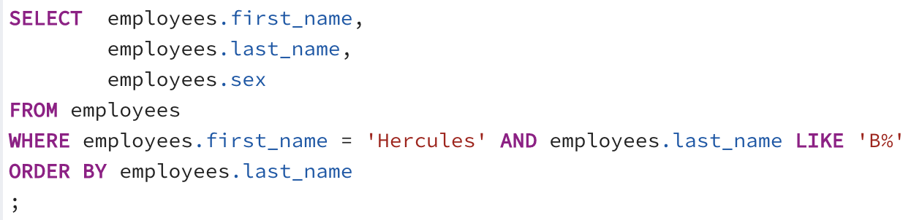
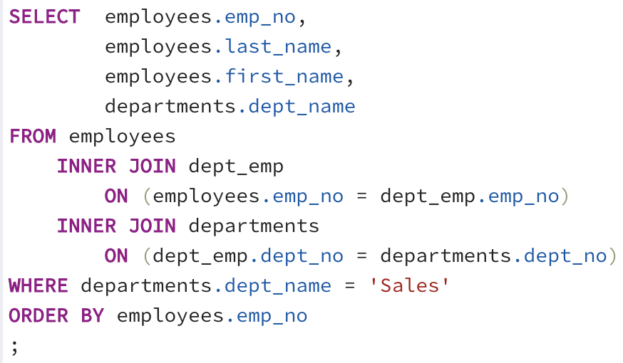
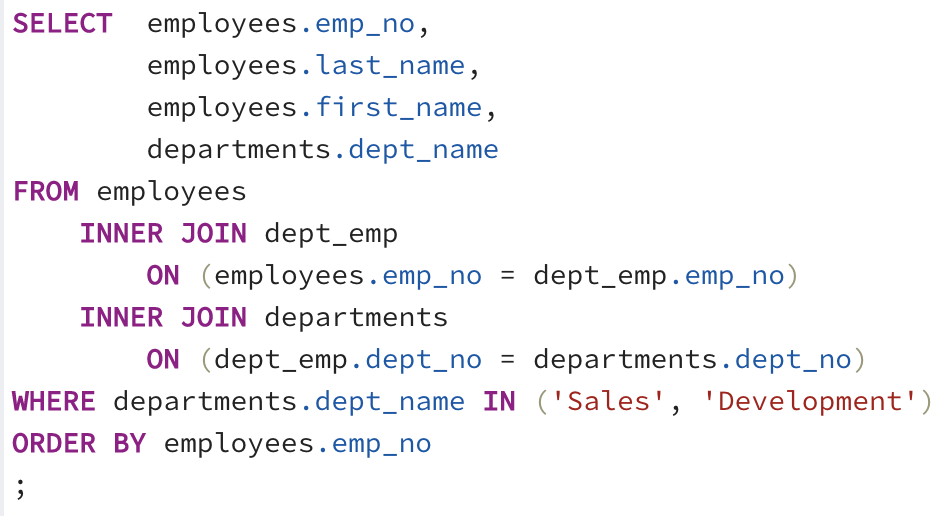
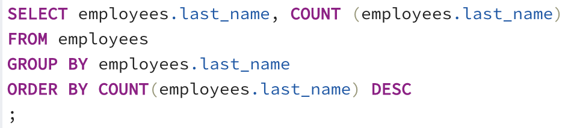
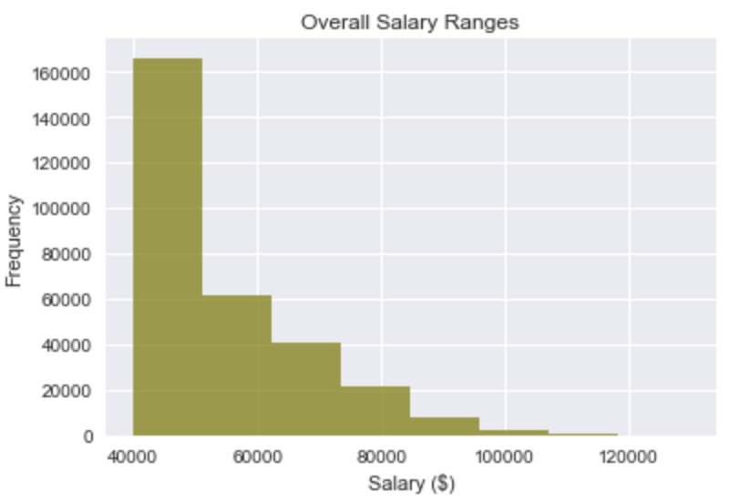

# Employee Database Design

<p align="center">
  
</p>

## Summary ##

This project demonstrates the ability to take six raw employee CSV data files, model and engineer a suitable relational database structure for the data, import the CSV files into the SQL database, and analyze the data through complex queries. SQL concepts in table design, data types, keys, joins, indexes and transactions are discussed in the step-by-step process below. 

Further data analysis is then performed using SQLAlchemy and Psycopg2 libraries in Python Pandas to connect to the SQL Database, inspect the tables, and import information for statistical visualizations using Matplotlib.

---

## Process ##
### Data Modeling
* 1. Inspect the employee CSV data sets.
* 2. Determine the data types, primary and foreign keys and other constraints.
* 2. Sketch out an Entity Relationship Diagram (ERD) of the tables using https://www.quickdatabasediagrams.com/.

### Data Engineering
* 1. Create a PostgreSQL database using employee data.
* 2. Create a table schema according to the ERD to hold each of the CSV files.
* 3. Ensure the column used for primary key designation was unique to each table, otherwise specified a composite key.
* 4. Ensure tables were created in the appropriate order to handle foreign keys.
* 3. Import employee each CSV data file into the corresponding SQL table.

### Query Analysis 
Query the data to specify each of the following aspects of the data. Export the output as a new CSV file. 
* 1. List the following details of each employee: employee number, last name, first name, sex, and salary.
<p align="center">
  
</p>

* 2. List first name, last name, and hire date for employees who were hired in 1986.
<p align="center">
  
</p>

* 3. List the manager of each department with the following information: department number, department name, the manager's employee number, last name, first name.
<p align="center">
  
</p>

* 4. List the department of each employee with the following information: employee number, last name, first name, and department name.
<p align="center">
  
</p>

* 5. List first name, last name, and sex for employees whose first name is "Hercules" and last names begin with "B."
<p align="center">
  
</p>

* 6. List all employees in the Sales department, including their employee number, last name, first name, and department name.
<p align="center">
  
</p>

* 7. List all employees in the Sales and Development departments, including their employee number, last name, first name, and department name.
<p align="center">
  
</p>

* 8. In descending order, list the frequency count of employee last names, i.e., how many employees share each last name.
<p align="center">
  
</p>

## Visual Analysis

* 1. Import the SQL database into Pandas using SQLAlchemy and Psycopg2, using the following code to connect to the PostgreSQL database:

   ```sql
   from sqlalchemy import create_engine
   engine = create_engine('postgresql://localhost:5432/<your_db_name>')
   connection = engine.connect()
   ```

* 2. Create a histogram to visualize the most common salary ranges for employees.
<p align="center">
  
</p>

* 3. Create a bar chart of average salary by title.
<p align="center">
  
</p>

---

## References ##
* [ERD tool](https://www.quickdatabasediagrams.com/)
* [Compound Key](https://en.wikipedia.org/wiki/Composite_key)
* [SQLAlchemy Documentation](https://docs.sqlalchemy.org/en/latest/core/engines.html#postgresql)
* [Gitignore Documentation](https://help.github.com/en/github/using-git/ignoring-files)
* [YouTube Gitignore tutorial](https://www.youtube.com/watch?v=2uaTPmNvH0I)

---

## Technologies Used ##
* PostgreSQL
* pgAdmin 4 - PostgreSQL IDE
* Jupyter Notebook
* Python - Pandas, Matplotlib, SQLAlchemy, Psycopg2

---

## Author ##
Kiran Rangaraj - 2021
* LinkedIn: [@Kiran Rangaraj](https://www.linkedin.com/in/kiranrangaraj/)
